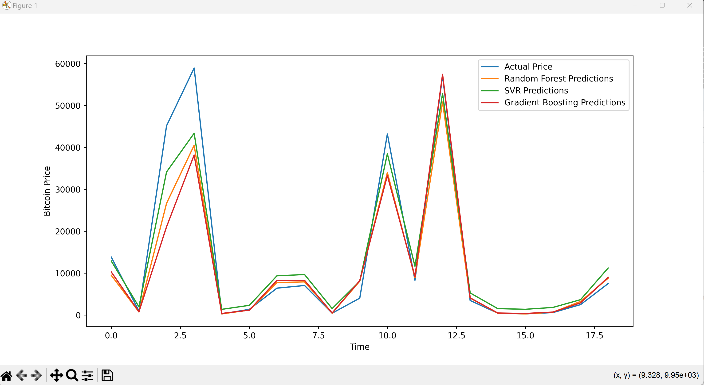

# Bitcoin Price Predictor

This project predicts Bitcoin's month-to-month price using historical data from Yahoo Finance and machine learning models, including **Random Forest**, **Support Vector Regressor (SVR)**, and **Gradient Boosting Regressor**.

## Features
- Monthly Bitcoin price prediction using historical data.
- Utilizes multiple regression models for comparison:
  - Random Forest
  - Support Vector Regressor (SVR)
  - Gradient Boosting Regressor
- Visualization of actual vs predicted prices.
- Evaluation of model accuracy using R² score.

## Project Structure
```bash
bitcoin_price_predictor/
│
├── bitcoin_price_predictor.py     # Main code for training models and making predictions
├── README.md                      # Project documentation
└── requirements.txt               # Python dependencies
```

## Installation

1. Clone the repository:
   ```bash
   git clone https://github.com/yourusername/bitcoin-price-predictor.git
   cd bitcoin-price-predictor
   ```

2. Create a virtual environment (optional but recommended):
   ```bash
   python -m venv env
   source env/bin/activate        # For Linux/Mac
   .\env\Scripts\activate         # For Windows
   ```

3. Install the required Python libraries:
   ```bash
   pip install -r requirements.txt
   ```

## Requirements

- Python 3.x
- Libraries:
  - `yfinance`
  - `scikit-learn`
  - `matplotlib`
  - `pandas`
  - `numpy`

You can find all the required dependencies in the `requirements.txt` file.

## Usage

1. Run the script to predict Bitcoin prices:

   ```bash
   python bitcoin_price_predictor.py
   ```

2. The script will:
   - Download historical Bitcoin price data from Yahoo Finance.
   - Resample the data to a monthly frequency.
   - Train and test the three models (Random Forest, SVR, Gradient Boosting).
   - Display a plot comparing actual vs predicted prices.
   - Output model performance using R² metrics.

## Models Used

- **Random Forest Regressor**: An ensemble model that fits multiple decision trees and averages the results to improve accuracy.
- **Support Vector Regressor (SVR)**: A model based on support vector machines, used here with an RBF kernel for regression tasks.
- **Gradient Boosting Regressor**: A boosting model that builds an additive model in a forward stage-wise manner, optimizing for predictive performance.

## Sample Output

The script will output a plot similar to this (actual price vs predictions for each model):



Additionally, it will print the accuracy metrics for each model in the terminal.

Random Forest Performance:
R-squared (R²): 0.8867070790923918

Support Vector Regressor Performance:
R-squared (R²): 0.9365531282366144

Gradient Boosting Performance:
R-squared (R²): 0.8462737497779578
